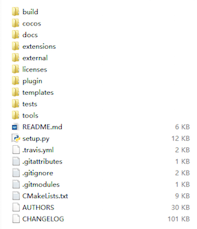
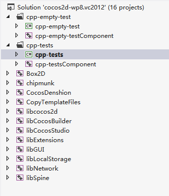
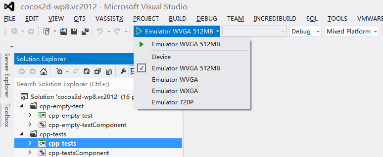
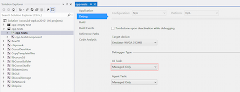
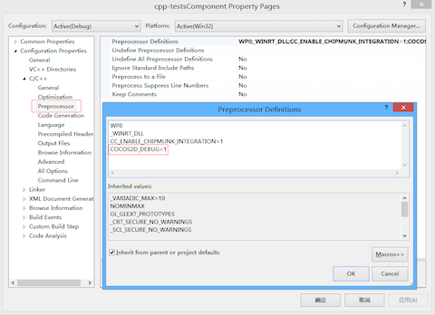

# Appendix H: Windows Phone 8 Installation and Setup

## Environmental Requirements
* Windows 8.0/8.1
* Cocos2d-x v3.3 [http://cocos2d-x.org/download](http://cocos2d-x.org/download)
* Visual Studio 2012+
* Windows Phone SDK 8.0 [http://dev.windowsphone.com/en-US/downloadsdk](http://dev.windowsphone.com/en-US/downloadsdk)

## Prerequisite
* Download Cocos2d-x and unzip it. (maybe: ~/)

* Register to be a Windows Phone Developer [http://msdn.microsoft.com/en-us/library/windowsphone/help/jj206719(v=vs.105](http://msdn.microsoft.com/en-us/library/windowsphone/help/jj206719(v=vs.105)

## Compile and Run the TestCpp Project
* Open `cocos2d-wp8.vc2012.sln` in the `build` folder

* Right click the `cpp-tests` project, and select `Set as StartUp Project`.

* Select `Emulator` or a `Device` to run the project on. If you sect `Device`
you need to connect your phone device using usb. Compile and run the `TestCpp`
project.

## How to debug in project
* Right click `cpp-tests`, select `Properties`, in `Debug`, select `debug` target.

* If you select `Managed Only` in `UI Task`, it's to debug c# code in `cpp-tests`.
If you select `Native Only`, it's to debug c++ code in `cpp-testsComponent`.
If you select `Native Only` and want to use `CCLog` function, right click
`cpp-testsComponent` and define `COCOS2D_DEBUG=1` in `Preprocessor Definitions`

